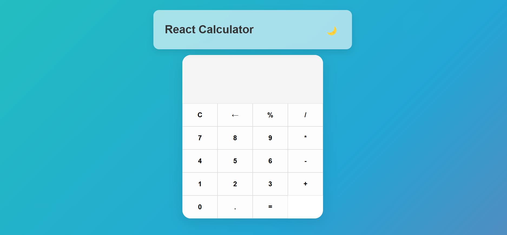
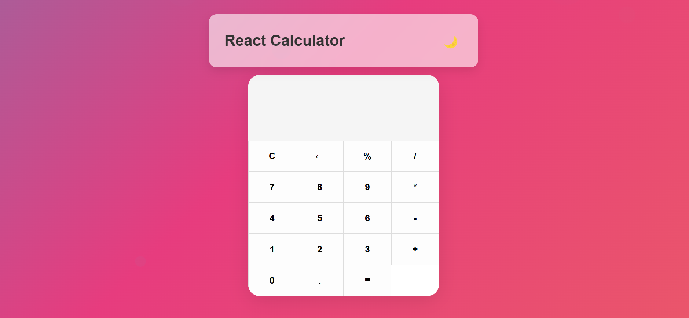
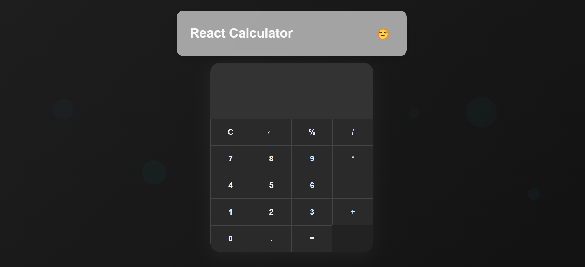

# 📱 React Calculator App

A sleek, animated calculator app built with **React**, featuring:

- 🌗 Light/Dark mode toggle  
- 🎉 Cool CSS animations (floating bubbles, animated gradient background)  
- 🧮 Basic calculator functions (add, subtract, multiply, divide)  
- ⚛️ Functional components and hooks  
- 📱 Fully responsive design

---

## 📸 Screenshots

### 🌞 Light Mode

  
  

### 🌙 Dark Mode

  

---

## 🚀 Features

- ✔️ Perform basic math operations
- 🌙 Toggle between light and dark themes
- ✨ Smooth and stylish UI with CSS animations
- 💻 Responsive for all screen sizes
- ⚛️ Built using React and CSS only

---

## 📂 Project Structure
react-calculator/ 
├── public/ │
└── index.html 
├── src/ 
│ ├── App.js 
│ ├── App.css 
│ ├── Calculator.js 
│ ├── Calculator.css 
│ └── index.js 
├── package.json 
└── README.md

